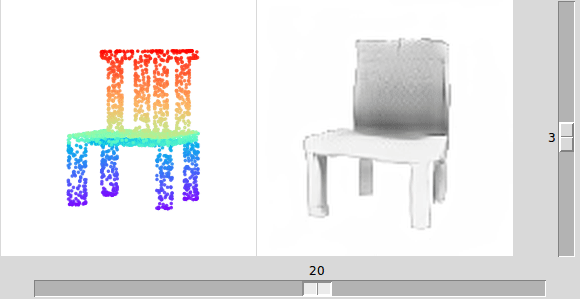

# pc2pix
**[A Conditional Generative Adversarial Network for Rendering Point Clouds](http://openaccess.thecvf.com/content_CVPRW_2019/papers/3D-WidDGET/Atienza_A_Conditional_Generative_Adversarial_Network_for_Rendering_Point_Clouds_CVPRW_2019_paper.pdf)** to be presented at [2019 CVPR Workshop](https://sites.google.com/view/3d-widget/home?authuser=0).

`pc2pix` code implementation in Keras(2.2.3) and Tensorflow (1.11). Surface reconstruction requires Blender and Meshlab.

Environment tested: Ubunutu Linux 16.04LTS, GPUs tested: 1060, 1080Ti and V100

## Demo

<a href="http://www.youtube.com/watch?feature=player_embedded&v=qrkHhar_ynk
" target="_blank"></a>

## Network architecture


## Single class (chair) rendering


## Multi-class rendering


## Latent interpolation


## Elevation and Azimuth


## Latent code arithmetic


## Dataset
- Datasets (ShapeNet point cloud and rendered images) can be downloaded here (1G + 28G):

`$ cd data`

- Download shapenet point cloud dataset from https://bit.ly/2RFzBeG

`$ tar xzvf  shape_net_core_uniform_samples_2048.tgz`

- Download shapenet render dataset from https://bit.ly/2RTa54Z 

`$ tar xzvf shapenet_release.tgz`
`$ cd ..`

## Testing 
Pre-compiled latent codes (to speed up point cloud encoder prediction)
Note: Needed only if pc2pix will be trained

- Download pc codes from https://goo.gl/JBL4sU or https://bit.ly/2AUra4N

`$ tar jxvf pc_codes.tar.bz2`

- Model weights of pc2pix and pt cloud autoencoder (1G)
Download model weights from https://goo.gl/3vMuxY or https://bit.ly/2CzFAae

`$ tar jxvf model_weights.tar.bz2`


- Evaluation code can be found in evaluation folder. All rendered images will be at evaluation/data

`$ cd evaluation`

1) For simplicity, assume chair dataset is used:

2) To perform surface surface reconstrucion from point clouds:

`$ python3 surface_reconstruction.py`

3) To render the surface reconstructed objects:

`$ python3 render_reconstruction.py`

4) To render point cloud using pc2pix:

`$ python3 render_by_pc2pix.py --ptcloud_ae_weights=../model_weights/ptcloud/chair-pt-cloud-stacked-ae-chamfer-5-ae-weights-32.h5 --generator=../model_weights/pc2pix/chair-gen-color.h5 --discriminator=../model_weights/pc2pix/chair-dis-color.h5 -c --category="chair"`

5) To calculate FID scores:

`$ python3 get_fid.py`

6) To calculate SSIM components:

`$ python3 get_ssim_components.py`

7) To get class similarity:

`$ python3 get_class_confidence.py`
`$ cd ..`

## Citation
If you find this work useful, please cite:

```
@InProceedings{Atienza_2019_CVPR_Workshops,
author = {Atienza, Rowel},
title = {A Conditional Generative Adversarial Network for Rendering Point Clouds},
booktitle = {The IEEE Conference on Computer Vision and Pattern Recognition (CVPR) Workshops},
month = {June},
year = {2019}
}
```
